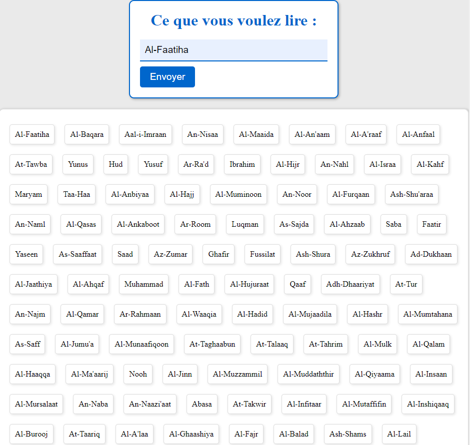
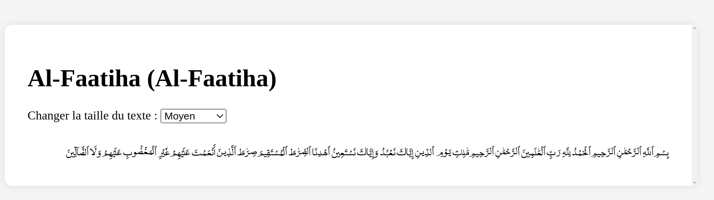

# Choses a modifier et/ou ajouter :
- [x] Le numero de la ayah (URGENT !!)
- [ ] Ajouter le hadith du jour
- [x] Fonction de recherche
- [x] Possibilité de changer la langue (arabe, francais, (anglais ??))
- [ ] Pouvoir cherches les hadiths par nom de livre (il faudrait avant d'ajouter la fonctionnalite de chercher des hadiths)
- [x] Mettre peut etre le css dans des fichiers a part ;)
# Bukhary_TEST
- J'essaie de faire un truc sympa avec le fichier json avec la sunnah écrite par AlBukhary(ra)
- Imagine quand meme une AI qui permet de voir si t'as bien recite ou pas, juste imagine (Tarteel)

# Nombre de livres :
- Il y a un total de 9 volumes (livres), pour voir tous les titres : 

```python
for i in range(len(data):
        print(data[i]["name"]))
```
# Tous les chapitres : 
- Il y a un total de 93 chapitre qu'on peut lister de la maniere suivante :

```python
for i in range(len(data)):
    for j in range(len(data[i]["books"])):
        print(data[i]["books"][j]["name"])
```
# Ajout du Quran
- J'ai ajouté le quran dans un fichier json, par le moment j'ai pas d'idee de projet en tete, si vous avez des idees n'hesitez pas a me contacter :)

# Voila comment lire le fichier json
- Pour voir le nom des sourates du quran :

```python
def quran():
    noms = []
    for i in range(len(data["sourates"])):
        noms.append(data["sourates"][i]["nom_phonetique"])
    return noms
```	 
# Habiitation Web
- Je suis en train de faire un site web pour que les gens puissent lire le quran et les hadiths, par le moment j'ai pas encore fini, j'ai quelques problemes avec le css, mais je vais essayer de le finir le plus vite possible

    - Par le moment j'utilise le framework Flask, mais je vais essayer de le faire avec Django dans un futur proche
    - Voila pour donner du css au fichier, oui ça m'a pris 2h pour trouver comment faire, mais j'ai enfin reussi, j'ai juste a mettre le fichier css dans le dossier static et ensuite je fais comme ça :) :
```html
<link rel="stylesheet" href="{{ url_for('static', filename = 'styles_quran.css') }}">
```
# Voila a quoi ça ressemble par le moment :


