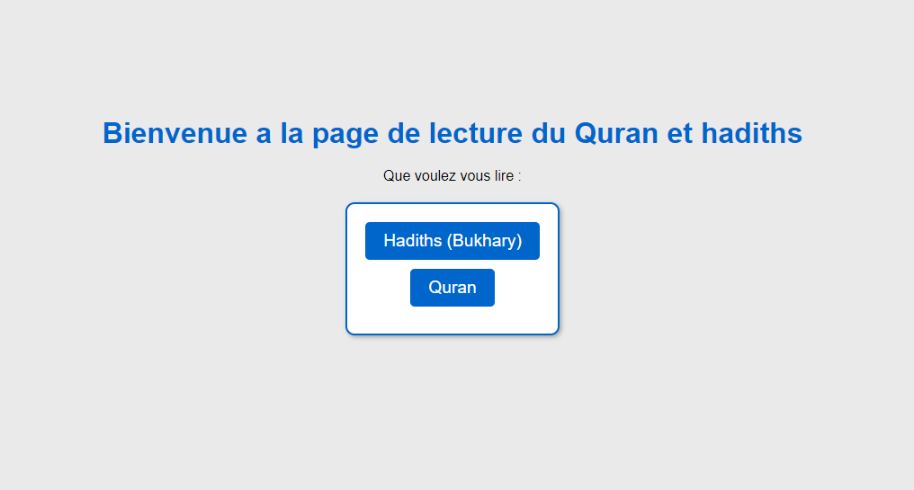

# Choses a modifier et/ou ajouter :

- [x] Que le num des ayat se deforment pas
- [x] Ajouter une page d'acceuil avec le choix hadiths ou quran
- [x] Page des Livres des hadith avec le choix du livre
- [ ] Ajouter un systeme de login pour que les gens puissent enregistrer leur progression
  - Pas tres urgent :
- [ ] Ajouter un systeme de recherche pour les hadiths
- [ ] Ajouter un systeme de recherche pour le quran par ayat/mot (sourate deja fait)

# Bukhary_TEST
- J'essaie de faire un truc sympa avec le fichier json avec la sunnah écrite par AlBukhary(ra)
- Imagine quand meme une AI qui permet de voir si t'as bien recite ou pas, juste imagine (Tarteel)

# Nombre de livres :
- Il y a un total de 9 volumes dans le Sahih Bukhary (livres), pour voir tous les titres : 

```python
for i in range(len(data):
        print(data[i]["name"]))
```
# Tous les chapitres : 
- Il y a un total de 93 chapitre dans le Sahih Bukhary qu'on peut lister de la maniere suivante :

```python
for i in range(len(data)):
    for j in range(len(data[i]["books"])):
        print(data[i]["books"][j]["name"])
```

# Voila comment lire le fichier json
- Pour voir le nom des sourates du quran :

```python
def quran():
    noms = []
    for i in range(len(data["sourates"])):
        noms.append(data["sourates"][i]["nom_phonetique"])
    return noms
```	 

```
# Voila a quoi ça ressemble par le moment :
## Page d'acceuil

## Page du quran

## Page d'une sourates

## Page Livres des hadiths

## Page d'un livre de hadiths

